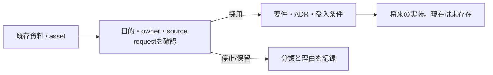

<!-- generated-by: scripts/generate_engineering_docs.py -->
# kakei-data — アーキテクチャ・システム構成（実装前）

> 生成日: 2026-07-15 / 対象: `kakei-data` / 確度: [高]
> 実装・manifest・既存資料の静的棚卸しに基づく。外部サービスの稼働状態と本番構成は未検証。

## 現在の状態

[高] runtime、entrypoint、API、永続schema、UI実装を検出していないため、存在しないApplication/Data/External構成を描かない。

## 既存asset

- `README.md`
- `architecture.drawio`

## 実装開始前に必要な決定

- owner、対象利用者、解く課題、成功指標、非目標。
- runtime/platform、data分類、外部連携、認証・権限、配備先。
- 最小のentrypoint、verification command、rollback/廃止条件。

## 禁止事項

- ディレクトリ名だけからAPI、DB、画面、SLO、production構成を確定しない。
- `Proposed` の判断を実装済み・承認済みとして扱わない。
